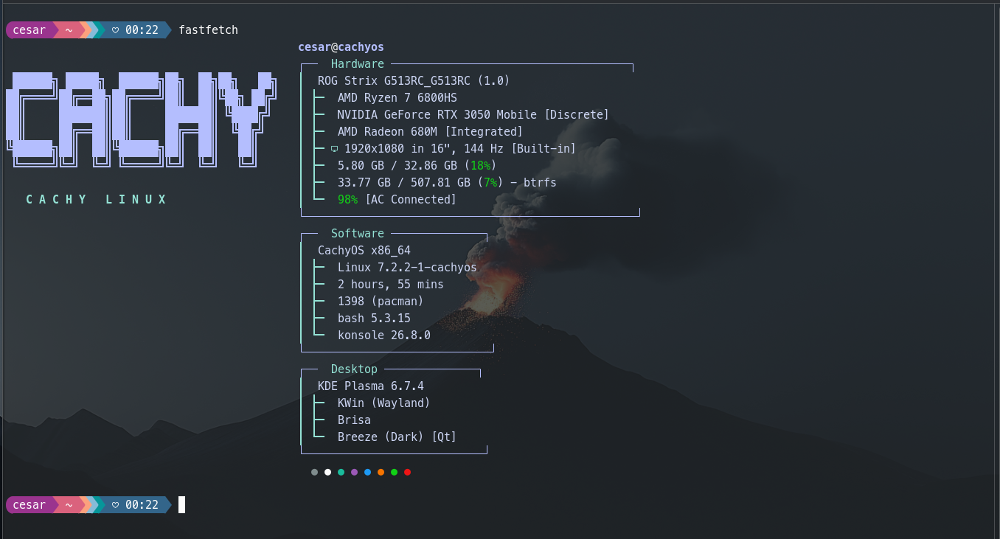

# Fastfetch Personalizado (CachyOS)

Configuración personalizada de [fastfetch](https://github.com/fastfetch-cli/fastfetch) para CachyOS, con logo en texto tipo banner ("CACHY") y paleta de colores lavender/teal.

## Vista previa



*(Sube aquí la captura de tu terminal con el resultado final)*

## Requisitos

- [fastfetch](https://github.com/fastfetch-cli/fastfetch) instalado (`sudo pacman -S fastfetch` en Arch/CachyOS)
- Una terminal con soporte de **Nerd Fonts**, para que se vean bien los iconos (, , 󰍹, 󰔠, etc.). Ejemplos: [JetBrainsMono Nerd Font](https://www.nerdfonts.com/), FiraCode Nerd Font.
- Terminal con buen soporte Unicode/UTF-8 (Konsole, Kitty, Alacritty, etc.)

## Instalación

1. Clona o descarga este repositorio.
2. Copia los archivos a tu carpeta de configuración de fastfetch:

   ```bash
   mkdir -p ~/.config/fastfetch
   cp config.jsonc ~/.config/fastfetch/config.jsonc
   cp logo.txt ~/.config/fastfetch/logo.txt
   ```

3. Ejecuta fastfetch:

   ```bash
   fastfetch
   ```

## Estructura

| Archivo        | Descripción                                                                 |
|----------------|------------------------------------------------------------------------------|
| `config.jsonc` | Configuración principal: módulos (Hardware/Software/Desktop), colores y logo |
| `logo.txt`     | Banner de texto "CACHY" con marcadores de color `$1` / `$2`                  |

## Personalización

- **Colores del logo:** editables en `config.jsonc`, bloque `logo.color` (`1` = texto grande "CACHY", `2` = subtítulo "CACHY LINUX").
- **Colores de la interfaz:** bloque `display.color` (`keys`, `title`, `output`), en formato ANSI RGB (`38;2;R;G;B`).
- **Módulos mostrados:** array `modules`, agrupados en tres bloques (Hardware, Software, Desktop) con bordes dibujados manualmente vía módulos `custom`.

## Créditos

Basado en la configuración estándar de fastfetch para CachyOS, con ajustes de logo, tipografía y paleta hechos a medida.
